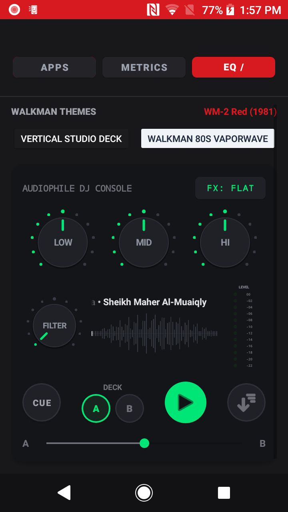

<div align="center">

  

  <br/><br/>

  

  <h1>SPINDLE</h1>
  <p><b>Analog Soul. Hi-Res Heart. Zero Bloat.</b></p>
  <p><i>The ultra-lightweight, hardware-tactile Android Home Launcher specifically crafted to repurpose compact smartphones and low-RAM DAPs into dedicated, physical-feeling audiophile music players.</i></p>

  <p>
    <a href="https://github.com/manaphassan/Spindle/releases"></a>
    
    
    
    
    
    <a href="LICENSE"></a>
  </p>

  <h4>
    <a href="https://manaphassan.github.io/Spindle/">🌐 Live Project Website</a>
    <span> · </span>
    <a href="docs/BRANDING.md">🎨 Branding Guide</a>
    <span> · </span>
    <a href="MASTER_DOCUMENTATION.md">📖 Technical Specs</a>
    <span> · </span>
    <a href="#-quick-start">🚀 Installation</a>
  </h4>

</div>

---

## 💡 The Philosophy: Repurpose, Revive, Rediscover

Modern smartphones are overloaded with algorithmic distractions, background trackers, and bloated operating systems. Meanwhile, millions of compact devices with extraordinary audio hardware—such as the **Sony Xperia X Compact (`SO-02J`)**, **Xperia Z5 Compact**, **LG V20/V30 with Quad-DACs**, and dedicated audio players (**HiBy, FiiO, Shanling, Astell&Kern**)—sit idle in drawers due to low RAM.

**Spindle transforms these devices into dedicated, standalone physical audiophile players:**
- **Zero AI & Zero Cloud Tracking**: No background machine learning models, no intrusive recommendations, no telemetry beacons, no cloud subscriptions. 100% deterministic, local, and private.
- **Pure Physical Feel**: Every dial, switch, knob, and lever is modeled after iconic industrial audio gear, providing rich haptic feedback and mechanical detents.
- **Extreme Low-RAM Architecture**: Runs fluidly at 60 FPS on as little as **1GB RAM** with an idle footprint under **25MB**.

---

## 📸 Interface Showcase

<div align="center">
  <table>
    <tr>
      <td width="50%" align="center">
        <b>Flagship Sony Walkman Cassette Deck</b><br/>
        <sub>Differential kinetic reels, analog ruler & mechanical buttons</sub><br/><br/>
        
      </td>
      <td width="50%" align="center">
        <b>Braun / Dieter Rams Online FM Radio</b><br/>
        <sub>Acoustic radial grille, 3D tuning roller & backlit LCD</sub><br/><br/>
        
      </td>
    </tr>
    <tr>
      <td width="50%" align="center">
        <b>Dark Audiophile DJ Mixer EQ Console</b><br/>
        <sub>Rotary potentiometers, 12-segment dB VU meter & waveform</sub><br/><br/>
        
      </td>
      <td width="50%" align="center">
        <b>Audiophile Music Catalog (⏏ EJECT)</b><br/>
        <sub>Category pill tabs, 2-column grid & persistent mini-player</sub><br/><br/>
        
      </td>
    </tr>
  </table>
</div>

---

## 🎛️ Key Features

### 1. 📼 Flagship Cassette Deck (Home Launcher)
- **Authentic Sony WM-2 & Studio Themes**: Inspired by the legendary 1981 Sony Walkman II in Vibrant Red, Brushed Metal Studio Deck, and 80s Cyberpunk Vaporwave.
- **Kinetic Differential Reel Physics**: True mechanical spool kinematics ($v = 4.7625\text{ cm/s}$) where the supply spool physically shrinks and accelerates while the take-up spool expands.
- **Mechanical Tactile Deck**: Physical `REW`, `FWD`, `PLAY`, and spring-loaded `⏏ EJECT` buttons with detent haptics.
- **Interactive Linear Tape Ruler**: Direct drag-to-seek scrub line calibrated in physical tape decimeters.

### 2. 📻 Braun / Dieter Rams Neumorphic Online FM Radio
- **Swipe-to-Tune**: Swiping right from the home deck slides seamlessly into the Dieter Rams-inspired matte ivory radio tuner.
- **Concentric Acoustic Speaker Grille**: Hardware-accelerated custom view rendering concentric perforation rings with realistic acoustic recess shadows, beautifully centered and fully visible.
- **3D Cylindrical Tuning Roller**: Tactile ribbed thumbwheel with moving calibrated frequency scale (`87.5 - 108.0 MHz`), red stationary cursor, and detent vibrations when passing stations. Tap the dial meter or LCD panel at any time to instantly toggle play and stop.
- **Backlit Vintage LCD Panel**: Mint-green LCD display showing frequency, station RDS marquee, and live stream connection status.
- **4 Starter Live Streams**: Direct one-tap auto-play and stop presets for:
  - **Lo-Fi Radio** (`88.5 MHz`)
  - **AnimeFM Radio** (`93.2 MHz`)
  - **Initial D World Radio** (`98.6 MHz`)
  - **CityPop Radio** (`104.2 MHz`)

### 3. 🎚️ Dark Audiophile DJ Mixer EQ Console (Settings)
- **Centralized Settings Access**: Easily opened from the dedicated **⚙️ Settings** icon in the Spindle App Listing header.
- **Obsidian Hardware Chassis**: Modeled after professional rotary club mixers, consolidating cassette themes, hardware EQ, storage scanning, and Bluetooth telemetry.
- **Studio Rotary Potentiometers**: 3 tactile knobs for `LOW`, `MID`, and `HI` with 11 perimeter detent dots and glowing mint-emerald notches (`#00E676`). Directly modulates Android's hardware `Equalizer` on the active audio session.
- **Filter Knob & BassBoost**: Dedicated rotary controller adjusting Android hardware `BassBoost` depth (0–1000).
- **12-Segment Stereo dB LED VU Meter**: Calibrated from `00` down to `-22 dB` with dynamic 15 FPS ballistics reacting in real time to audio peaks.
- **Live Symmetrical Waveform Visualizer**: High-density vertical bars vibrating in sync with music playback.
- **Transport Deck & Crossfader**: Tactile `CUE` button, `DECK A` (Cassette) & `DECK B` (Radio) selectors, radiant Play/Pause button, and horizontal crossfader `A ──|── B`.

### 4. 🗂️ Audiophile Music Catalog (`⏏ EJECT` Overlay)
- **Cassette Door Ejection**: Tapping `⏏ EJECT` triggers the full-screen dark music library overlay.
- **Comprehensive Browsing**: Instant pill tabs for `SONGS`, `ALBUMS`, `ARTISTS`, `FOLDERS`, and `RATED ★`.
- **2-Column Album Grid**: Artwork cards with track tally badges and circular quick-play buttons.
- **Persistent Bottom Mini-Player**: Floats with track metadata, playback controls (`⏮`, `▶ / ❚❚`, `⏭`), and tap-to-return navigation.

### 5. 🔋 Bluetooth Battery Health & Bit-Perfect Telemetry
- **Connected Bluetooth Battery Monitoring**: Real-time broadcast listener capturing connected wireless headphones/earbuds battery percentage (`● Sony WH-1000XM4: 85% (Healthy)`).
- **Device Hardware LED**: Real-time battery indicator on Walkman chassis reflecting system charge states.
- **Bit-Perfect DAC Path**: Real-time telemetry tracking sample rate, bit depth, format, dynamic bitrate, and AudioFlinger 48kHz resampling detection.

---

## ⚡ Technical Benchmarks: Extreme Low RAM

| Metric | Standard Android Player | Spindle Launcher | Advantage |
| :--- | :--- | :--- | :--- |
| **Idle Memory** | 120MB – 250MB | **< 25MB** | **85% less RAM** |
| **Active Playback RAM** | 180MB – 350MB | **< 38MB** | **80% less RAM** |
| **APK File Size** | 45MB – 95MB | **< 4.5MB** | **92% smaller** |
| **UI Framework** | Compose / WebView | **Pure Native Canvas** | Zero GC stutters |
| **Bitmap Format** | ARGB_8888 (32-bit) | **RGB_565 (16-bit)** | 50% image cache savings |
| **Background AI / ML** | 150MB+ models | **NONE (0MB)** | Zero battery drain |
| **Min SDK** | Android 10+ | **Android 8.0 (API 26)** | Legacy device revive |

---

## 🛠️ Architecture & Project Structure

```
dap_launcher/
├── app/src/main/
│   ├── java/com/hana/spindle/
│   │   ├── data/                 # Room DB, POSIX Storage Scanner, ImageLoader (RGB_565)
│   │   ├── playback/             # ExoPlayer Engine, AudioFxController, RadioStreamEngine, Telemetry
│   │   ├── launcher/             # Lightweight App Drawer Loader (<2MB overhead)
│   │   ├── theme/                # Parametric Cassette Styles & Color Palettes
│   │   └── ui/
│   │       ├── cassette/         # Kinetic Reels, Vertical Studio Deck View, WM-2 Chassis
│   │       ├── radio/            # Braun Speaker Grille, 3D Ribbed Tuning Dial View, RadioFragment
│   │       ├── eq/               # Audiophile Knob View, 12-Seg LED VU Meter, Waveform View
│   │       ├── catalog/          # Song, Album, and Folder Recycler Adapters
│   │       ├── CatalogFragment   # Music Catalog Wireframe Overlay
│   │       ├── DrawerFragment    # App Drawer, Telemetry & DJ Console
│   │       ├── PlayerFragment    # Center Home Screen Walkman Deck
│   │       └── MainActivity      # 3-Page ViewPager2 Launcher Controller
│   └── res/                      # Hardware vector graphics, layouts, and styles
├── docs/                         # Live GitHub Pages assets and branding guides
│   ├── assets/                   # High-res logos, banners, and verified screenshots
│   ├── BRANDING.md               # Design systems, color specs, and industrial design philosophy
│   └── index.html                # Live interactive showcase page
```

---

## 🚀 Quick Start

### Prerequisites
- Android device or DAP running **Android 8.0 Oreo (API 26)** or newer.
- For USB DAC or 3.5mm Direct ALSA output: Any Qualcomm WCD93xx, Cirrus Logic, ESS Sabre, or AKM equipped device.

### Installation via ADB
```bash
# Clone repository
git clone https://github.com/manaphassan/Spindle.git
cd Spindle

# Build debug APK
./gradlew assembleDebug

# Install directly to connected device
adb install -r app/build/outputs/apk/debug/app-debug.apk

# Launch Spindle
adb shell am start -n com.hana.spindle.debug/com.hana.spindle.ui.MainActivity
```

### Set as Default Home Launcher
1. Navigate to Android **Settings** → **Apps & Notifications** → **Default Apps**.
2. Select **Home app** → Choose **Spindle**.
3. Press hardware Home button anytime to return directly to the Sony Walkman Cassette Player.

---

## 🎨 Design Heritage & Accreditations
- **Sony Walkman WM-2 (1981)**: Industrial design inspiration by Sony Corporation (Norio Ohga & Sony Design Center).
- **Braun T3 / TP1 (1959)**: Acoustic perforation and functional minimalism principles by **Dieter Rams**.
- **Pioneer & Technics Rotary Mixers**: DJ console potentiometer ergonomics and dB ladder ballistics.

---

## 🛡️ License

Spindle is distributed under the **Apache License 2.0**. See the [LICENSE](LICENSE) file for details.

```
Copyright 2026 HaNa Innovation

Licensed under the Apache License, Version 2.0 (the "License");
you may not use this file except in compliance with the License.
You may obtain a copy of the License at

    http://www.apache.org/licenses/LICENSE-2.0
```

<div align="center">
  <sub>Engineered with precision for audiophiles, analog purists, and old hardware preservation.</sub>
</div>
