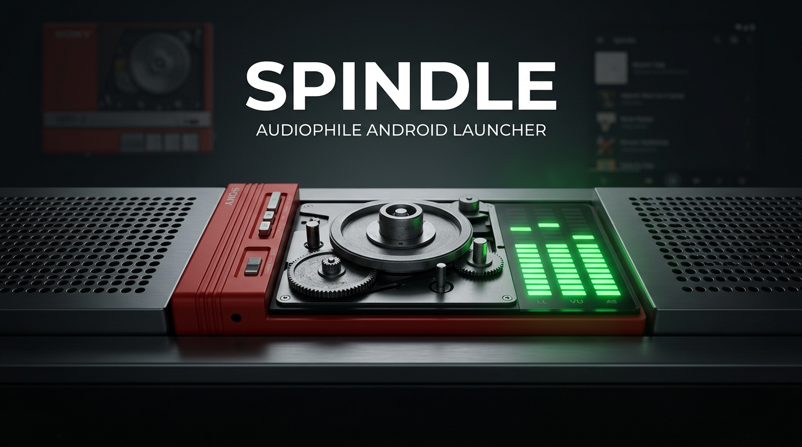
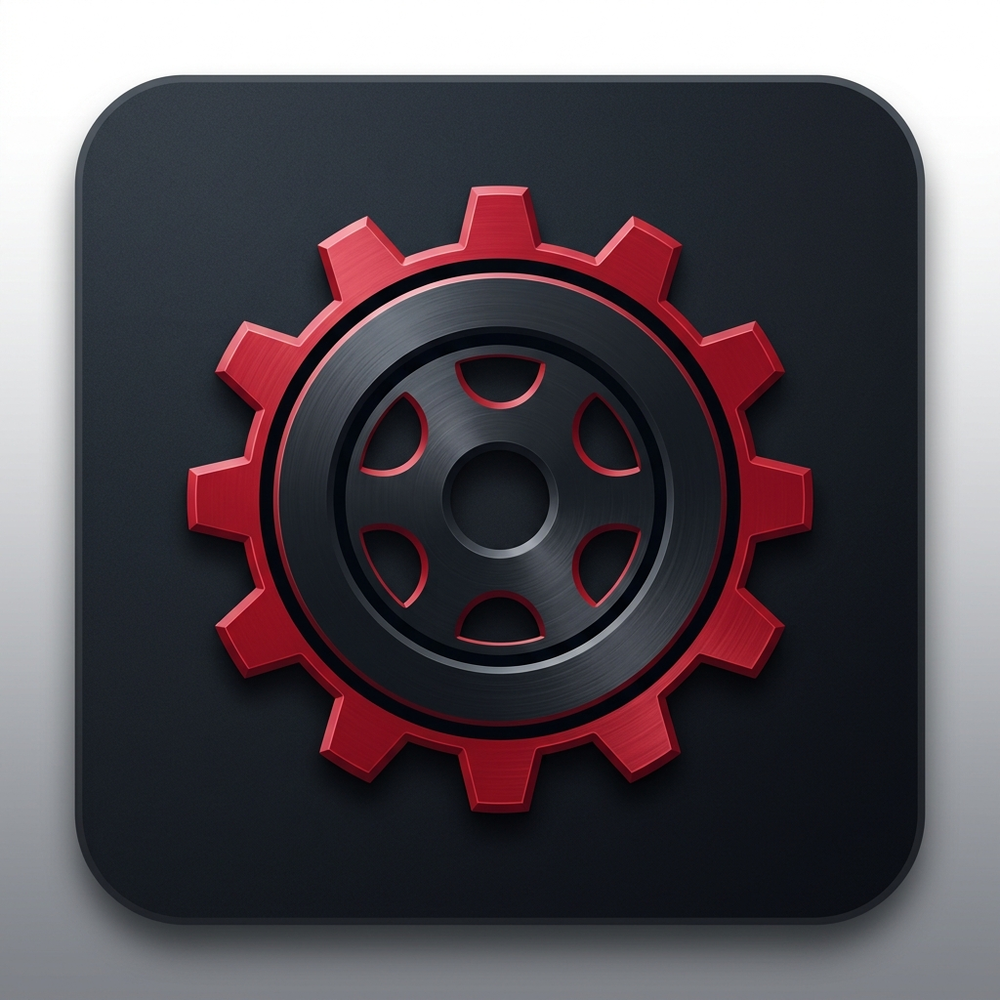

<div align="center">

  

  <br/><br/>

  

  <h1>SPINDLE</h1>
  <p><b>Analog Soul. Hi-Res Heart. Zero Bloat.</b></p>
  <p><i>The ultra-lightweight, hardware-tactile Android Home Launcher specifically crafted to repurpose compact smartphones and low-RAM DAPs into dedicated, physical-feeling audiophile music players.</i></p>

  <p>
    <a href="https://github.com/manaphassan/Spindle/releases/tag/v1.3.0-alpha"></a>
    
    
    
    
    
    <a href="https://paypal.me/manaphassan"></a>
    <a href="LICENSE"></a>
  </p>

  <h4>
    <a href="https://manaphassan.github.io/Spindle/">🌐 Live Project Website</a>
    <span> · </span>
    <a href="docs/BRANDING.md">🎨 Branding Guide</a>
    <span> · </span>
    <a href="MASTER_DOCUMENTATION.md">📖 Technical Specs</a>
    <span> · </span>
    <a href="#-quick-start">🚀 Installation</a>
    <span> · </span>
    <a href="#-support-development">💖 Donate</a>
  </h4>

</div>

---

## 💡 The Philosophy & 5 Core Pillars

Modern smartphones are overloaded with algorithmic distractions, background trackers, and bloated operating systems. Meanwhile, millions of compact devices with extraordinary audio hardware—such as compact vintage smartphones with dedicated DACs and dedicated Digital Audio Players (DAPs)—sit idle in drawers due to low RAM.

```
   ┌────────────────────────────────────────────────────────┐
   │                  THE 5 PILLARS OF SPINDLE              │
   ├────────────────────────────────────────────────────────┤
   │  1. 🔓 ALWAYS FREE         │  Zero paywalls on music   │
   │  2. 📴 OFFLINE FIRST       │  100% local, zero tracking│
   │  3. ⚡ ULTRA-LIGHTWEIGHT   │  < 25MB RAM, pure Canvas  │
   │  4. 🛡️ ZERO AI             │  No algorithms, no bloat  │
   │  5. 📼 ANALOG INSPIRED     │  Kinetic reels & mechanics│
   └────────────────────────────────────────────────────────┘
```

**Spindle transforms these devices into dedicated, standalone physical audiophile players:**
- **Zero AI & Zero Cloud Tracking**: No background machine learning models, no intrusive recommendations, no telemetry beacons, no cloud subscriptions. 100% deterministic, local, and private.
- **Pure Physical Feel**: Every dial, switch, knob, and lever is modeled after iconic industrial audio gear, providing rich haptic feedback and mechanical detents.
- **Extreme Low-RAM Architecture**: Runs fluidly at 60 FPS on as little as **1GB RAM** with an idle footprint under **25MB** ($<18\text{MB}$ on Spindle Lite).
- **Modern Audiophile Catalog & Lyrics**: Elegant single-audio Now Playing screen with circular radial scrub arc, live audio waveform, synced lyrics drawer, and A-Z alphabet index scroller.

---

## 📸 Interface Showcase

<div align="center">
  <table>
    <tr>
      <td width="50%" align="center">
        <b>Kinetic Cassette Deck & 2-Row Routing</b><br/>
        <sub>Traveling tape ribbon, rotating anisotropic sheen & 2-row bit-perfect badges</sub><br/><br/>
        
      </td>
      <td width="50%" align="center">
        <b>Dedicated Vintage Lock Screen Player</b><br/>
        <sub>Keyguard transport deck, digital counter & hardware battery telemetry</sub><br/><br/>
        
      </td>
    </tr>
    <tr>
      <td width="50%" align="center">
        <b>Analog FM Radio & Ballistic RF Meter</b><br/>
        <sub>Galvanometer RF signal needle, ruby red STEREO pilot & 4-color lamp glow</sub><br/><br/>
        
      </td>
      <td width="50%" align="center">
        <b>Dual Analog VU Meters & 10-Band EQ</b><br/>
        <sub>Ballistic needle physics with +3dB redline, peak LEDs & AutoEq headphone curves</sub><br/><br/>
        
      </td>
    </tr>
    <tr>
      <td width="50%" align="center">
        <b>Dedicated Single Audio Now Playing</b><br/>
        <sub>Minimalist circular cover, radial arc scrubber, dynamic waveform & lyrics drawer</sub><br/><br/>
        
      </td>
      <td width="50%" align="center">
        <b>Audiophile Music Catalog (⏏ EJECT)</b><br/>
        <sub>A-Z alphabet fast scroller, sorting chips, format filters & floating mini-player</sub><br/><br/>
        
      </td>
    </tr>
  </table>
</div>

---

## 🎛️ Key Features

### 1. 📼 Flagship Cassette Deck (Home Launcher)
- **Centered Spindle Deck Window**: Horizontally centered clear acrylic window showcasing mechanical tape spools with true differential kinematics ($v = 4.7625\text{ cm/s}$).
- **Kinetic Magnetic Ribbon & Spool Motion**:
  - **Traveling Magnetic Tape Oxide**: Traveling micro-striations actively gliding vertically between the supply and take-up spools at physical tape playback speed.
  - **Rotating Anisotropic Specular Sheen**: Two opposing radial glare cones sweeping across the wound tape pack as the reels spin.
  - **Classic 3-Spoke Flange Cutouts**: Three vintage strobe circular window cutouts orbiting the hub core at 60 FPS with zero GC allocation.
- **2-Row Real-Time Output Routing Badges**:
  - **Row 1**: High-resolution format specifications (`FLAC • 24-bit / 96kHz`) with generous vertical headroom.
  - **Hairline Divider**: Crisp separator line between audio specifications and physical routing.
  - **Row 2**: Output destination telemetry (`3.5mm DIRECT` in bit-perfect cyan, or external USB DAC routing) with comfortable line-height.
- **Column-Aligned Telemetry Layout**:
  - **Dynamic Hardware Nameplate Header**: Automatically detects connected hardware model via `Build.MODEL` and `Build.DEVICE` (e.g., `SONY SO-02J • OREO`), formatting it into an authentic uppercase engraved nameplate.
  - **2-Line Active Track Metadata**: Bold crisp song title (Line 0) and artist name with active duration (Line 1).
- **24-bit 96kHz FLAC Bit-Perfect Engine**: Direct Qualcomm Snapdragon and USB-OTG ALSA playback with high-resolution codec negotiation.
- **Physical Mechanical Controls**: Authentic `REW`, `FWD`, `PLAY/PAUSE`, and spring-loaded `⏏ EJECT` buttons with haptic clicks.

### 2. 💿 Dedicated Single Audio Now Playing (Catalog Overlay)
- **Minimalist Audiophile Interface**: Pure distraction-free now playing page with deep obsidian backdrop.
- **Circular Album Art & Radial Arc Scrubber**: Custom touch-sensitive radial arc tracking playback progress with smooth rotational touch scrub.
- **Live Dynamic Waveform Visualizer**: Hardware-accelerated 24-band frequency envelope visualizer pulsing in sync with music playback.
- **Hi-Res Format Telemetry Badge**: Real-time pill displaying container, bit depth, sample frequency, and live bitrate (`FLAC 16-bit / 44.1kHz • 846 kbps`).
- **Expandable Synced Lyrics Drawer**: Clean bottom drawer parsing `.lrc` timestamp files with real-time autoscroll, or displaying embedded text lyrics.
- **Technical File Specs Dialog**: Instant inspector revealing codec, format, sample rate, bit depth, channel configuration, exact bitrate, file size, and filesystem path.
- **Audiophile Transport Strip**: Shuffle mode, 3-state Repeat toggle (`Off` ➔ `Repeat All` ➔ `Repeat Single`), track skip (`⏮ / ⏭`), smooth play/pause (`▶ / ❚❚`), and favorite toggle.

### 3. 🗂️ Audiophile Music Catalog (`⏏ EJECT` Overlay)
- **A-Z Fast Alphabet Scroller**: Tactile right-edge vertical alphabet index strip with haptic vibration detents for instant library jumping.
- **Minimalist Sorting & Grouping**: One-tap dialog sorting library by **Title**, **Artist**, **Album**, **Year**, **Duration**, or **Bitrate**.
- **Hi-Res Format Filtering**: Instant filter chips for `All`, `Hi-Res (24-bit+)`, `Lossless (FLAC/WAV)`, and `MP3`.
- **Persistent Floating Mini-Player**: Bottom docked player with track thumbnail, metadata, transport controls, and tap-to-expand into the single audio Now Playing screen.
- **Direct Return to Home**: Tapping back smoothly resumes the physical analog cassette home deck.

### 4. 📻 Bauhaus Minimalist Online FM Radio with RF Meter
- **Ballistic Galvanometer RF Signal Meter**: Vintage needle movement calculating real-time RF signal strength across 0–5 S-units with green center-channel band.
- **Ruby Red STEREO Pilot LED**: Dynamic diode glow illuminating upon receiving stereo FM stream lock.
- **4-Color Incandescent Lamp Cycling**: Tap the signal window to toggle backlights: **Amber Incandescent**, **Vintage Cyan/Teal**, **Mint Green**, and **Warm Parchment**.
- **Concentric Acoustic Speaker Grille**: Hardware-accelerated custom view rendering concentric perforation rings with realistic acoustic recess shadows.
- **3D Flywheel Inertia Tuning Dial**: Tactile thumbwheel with physical momentum coasting, velocity decay, and detent vibration ticks when passing stations.
- **Backlit Vintage LCD Panel**: Mint-green LCD display showing frequency, station RDS marquee, and live stream connection status.

### 5. 🔒 Dedicated Vintage Lock Screen Player
- **Keyguard-Bypassing Transport Deck**: Dedicated full-screen player displaying securely over the Android lock screen on screen-off.
- **Vintage Hardware Interface**: Features full physical REW / FWD / PLAY / EJECT transport levers, live 7-segment digital counter, and direct battery/route telemetry.
- **Swipe-Up Dismissal**: Effortless upward swipe gesture to dismiss back to the device launcher.
- **Toggleable in Settings**: User-configurable switch under DAP Hardware & Audio Engine settings.

### 6. 🎚️ Studio Sound Deck: Dual Analog VU Meters & 10-Band ISO EQ
- **Dual Analog Ballistic VU Meters**: Dedicated left and right channel galvanometer needles with warm vintage dial face, +3dB redline scale, and glowing peak indicator LEDs.
- **10-Band ISO Parametric Studio Equalizer**: Full hardware-accelerated equalizer with preloaded AutoEq frequency curves for legendary audiophile headphones.
- **Mechanical Cassette Foley Engine**: Procedural 16-bit sound generation for solenoid clicks, head engagement, and tape motor transport sounds.

### 7. 🎨 Settings, App Drawer & 3 Hardware Themes
- **3 Curated Hardware Themes**:
  - **Audiophile Dark (Obsidian)**: Deep charcoal and OLED black with glowing mint accents.
  - **Monochrome E-Ink**: Ultra-high-contrast pure black and white tailored specifically for e-paper / e-ink DAPs (Onyx Boox, Hisense).
  - **Clean Light (Brushed Aluminum)**: Industrial silver and crisp white minimalist aesthetic.
- **Master Volume Slider Deck**: Tactile hardware slider with Left/Right stereo channel balance visualization.
- **Offline Storage Scanner**: Direct directory selector for microSD card or internal music folders with fast background metadata indexing.
- **Lightweight App Drawer**: Zero-bloat app launcher (<2MB overhead) with touch-magnified Niagara-style alphabet rail.

---

## ⚡ Technical Benchmarks: Extreme Low RAM

| Metric | Standard Android Player | Spindle Launcher | Advantage |
| :--- | :--- | :--- | :--- |
| **Idle Memory** | 120MB – 250MB | **< 25MB** | **85% less RAM** |
| **Active Playback RAM** | 180MB – 350MB | **< 38MB** | **80% less RAM** |
| **APK File Size** | 45MB – 95MB | **< 4.5MB** | **92% smaller** |
| **UI Framework** | Compose / WebView | **Pure Native Canvas** | Zero GC stutters |
| **Bitmap Format** | ARGB_8888 (32-bit) | **RGB_565 (16-bit)** | 50% image cache savings |
| **Background AI / ML** | 150MB+ models | **NONE (0MB)** | Zero battery drain |
| **Min SDK** | Android 10+ | **Android 8.0 (API 26)** | Legacy device revive |

---

### 📦 Spindle Edition Matrix

| Feature | Spindle Standard (`:app`) | Spindle Lite (`:app-lite` / `satsuma`) |
| :--- | :--- | :--- |
| **Target OS** | Android 8.0 – 15 (API 26 – 35) | **Android 4.4 KitKat (API 19)** *(down to API 16)* |
| **Target Hardware** | 1GB – 4GB RAM DAPs & Compacts | **512MB RAM Legacy Devices** *(3.0" HVGA & Compact DAPs)* |
| **Audio Engine** | `androidx.media3` (ExoPlayer 1.5.1) | **Native `android.media.MediaPlayer`** (Zero bloat) |
| **Screen Target** | 720p – 1080p (16:9 – 21:9) | **320 × 480 (HVGA 3:2)** Responsive Canvas |
| **Hardware Key Hooks** | Android MediaSession | **Dedicated Camera Key (`KEYCODE_CAMERA`) + Volume Skip** |
| **Active Playback RAM** | $< 38\text{ MB}$ | **$< 18\text{ MB}$** |
| **APK Binary Size** | $< 4.5\text{ MB}$ | **$< 1.8\text{ MB}$** |
| **Documentation** | [MASTER_DOCUMENTATION.md](MASTER_DOCUMENTATION.md) | [SPINDLE_LITE_MASTER_DOCUMENTATION.md](docs/SPINDLE_LITE_MASTER_DOCUMENTATION.md) |

---

## 🛠️ Architecture & Project Structure

```
dap_launcher/
├── app/src/main/
│   ├── java/com/hana/spindle/
│   │   ├── data/                 # Room DB, POSIX Storage Scanner, ImageLoader (RGB_565), TagParser, LyricsParser
│   │   ├── playback/             # ExoPlayer Engine, RadioStreamEngine, AudioMetricsTracker
│   │   ├── launcher/             # Lightweight App Drawer Loader (<2MB overhead)
│   │   ├── theme/                # Cassette Themes & Color Palettes (Dark, E-Ink, Light)
│   │   └── ui/
│   │       ├── cassette/         # Kinetic Reels, VerticalDeckView, CassetteKinematics
│   │       ├── radio/            # Acoustic Speaker Grille, 3D Ribbed Tuning Dial View, RadioFragment
│   │       ├── catalog/          # CircularCoverArcView, AudioWaveformView, CatalogSortGroup, SortGroupBottomSheet
│   │       ├── AlphabetIndexView # Tactile A-Z alphabet scroller
│   │       ├── LyricsAdapter     # Real-time synced lyrics line adapter
│   │       ├── DialogFileSpecs   # Audiophile technical file specifications inspector
│   │       ├── CatalogFragment   # Music Catalog & Single Audio Now Playing Overlay
│   │       ├── DrawerFragment    # App Drawer, Volume Slider, Themes & Radio Manager
│   │       ├── PlayerFragment    # Center Home Screen Cassette Deck
│   │       └── MainActivity      # 3-Page ViewPager2 Launcher Controller
│   └── res/                      # Hardware vector graphics, layouts, and styles
├── docs/                         # Live GitHub Pages assets and branding guides
│   ├── assets/                   # High-res logos, banners, and verified screenshots
│   ├── BRANDING.md               # Design systems, color specs, and industrial design philosophy
│   └── index.html                # Live interactive showcase page
```

---

## 🗺️ Development Roadmap

| Version | Phase / Tier | Key Deliverables | Status |
| :--- | :--- | :--- | :---: |
| **`v1.2.0`** | **Spindle Basic (Flagship)** | Kinetic Spindle Deck, Radial Arc Scrubber, 24-Band Waveform, Dynamic Nameplate, A-Z Index | **✅ Released** |
| **`v1.3.0-alpha`** | **Spindle Flagship & Lite** | Kinetic Ribbon Reels, 2-Row Routing Badges, Lock Screen Player, Analog RF Meter, 24-bit FLAC, `:app-lite` | **✅ Alpha Released** |
| **`v1.4.0`** | **Spindle Pro (Studio)** | Reel-to-Reel Open Deck, 10-Band ISO Parametric EQ, Tape Saturation DSP, Foley Sound Engine | **📅 Planned** |
| **`v2.0.0`** | **Ecosystem & Bit-Perfect** | Direct USB-OTG ALSA Class 2.0 driver, Cross-DAP MicroSD Catalog Sync, CUE Sheet Splitter | **🔮 Future** |

---

## 🚀 Quick Start

### Prerequisites
- Android device or DAP running **Android 8.0 Oreo (API 26)** or newer.
- For USB DAC or 3.5mm Direct ALSA output: Any Qualcomm WCD93xx, Cirrus Logic, ESS Sabre, or AKM equipped device.

### Installation via ADB
```bash
# Clone repository
git clone https://github.com/manaphassan/Spindle.git
cd Spindle

# Build optimized release APK (4.8 MB with R8 & ProGuard)
./gradlew assembleRelease

# Install directly to connected device or DAP
adb install -r app/build/outputs/apk/release/app-release.apk

# Launch Spindle
adb shell am start -n com.hana.spindle/com.hana.spindle.ui.MainActivity
```

### Set as Default Home Launcher
1. Navigate to Android **Settings** → **Apps & Notifications** → **Default Apps**.
2. Select **Home app** → Choose **Spindle**.
3. Press hardware Home button anytime to return directly to the Spindle Cassette Player.

---

## 💖 Support Development

Spindle is **100% free**, **open-source**, and developed with immense passion for analog aesthetics, audio purism, and extending the lifespan of compact smartphones and digital audio players (DAPs).

We have **zero ads, zero cloud telemetry, and zero algorithmic subscriptions**.

If Spindle has breathed new life into your vintage hardware or you appreciate the craftsmanship behind our custom physical UI and bit-perfect audio engine, please consider supporting ongoing development:

<div align="center">
  <a href="https://paypal.me/manaphassan">
    
  </a>
  <br/><br/>
  <p><b>Direct Link:</b> <a href="https://paypal.me/manaphassan">https://paypal.me/manaphassan</a></p>
  <sub>Every contribution directly funds testing hardware, low-RAM optimization, and direct ALSA audio driver engineering. Thank you!</sub>
</div>

---

## 🎨 Design Heritage & Accreditations
- **1980s Japanese Industrial Design**: Mechanical tape spool kinematics and tactile physical button ergonomics.
- **Bauhaus & German Functionalism**: Acoustic perforation patterns, geometric speaker grilles, and calibrated tuning dials.
- **Classic Studio Audio Consoles**: Potentiometer ergonomics and high-precision dB ballistics.

---

## 🛡️ License

Spindle is distributed under the **Apache License 2.0**. See the [LICENSE](LICENSE) file for details.

```
Copyright 2026 HaNa Innovation

Licensed under the Apache License, Version 2.0 (the "License");
you may not use this file except in compliance with the License.
You may obtain a copy of the License at

    http://www.apache.org/licenses/LICENSE-2.0
```

<div align="center">
  <sub>Engineered with precision for audiophiles, analog purists, and old hardware preservation.</sub>
</div>
