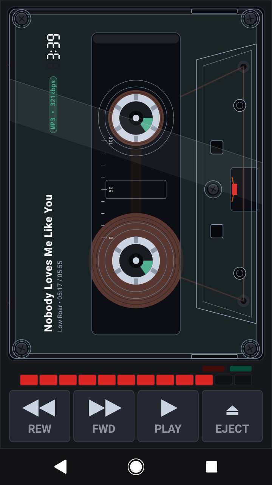
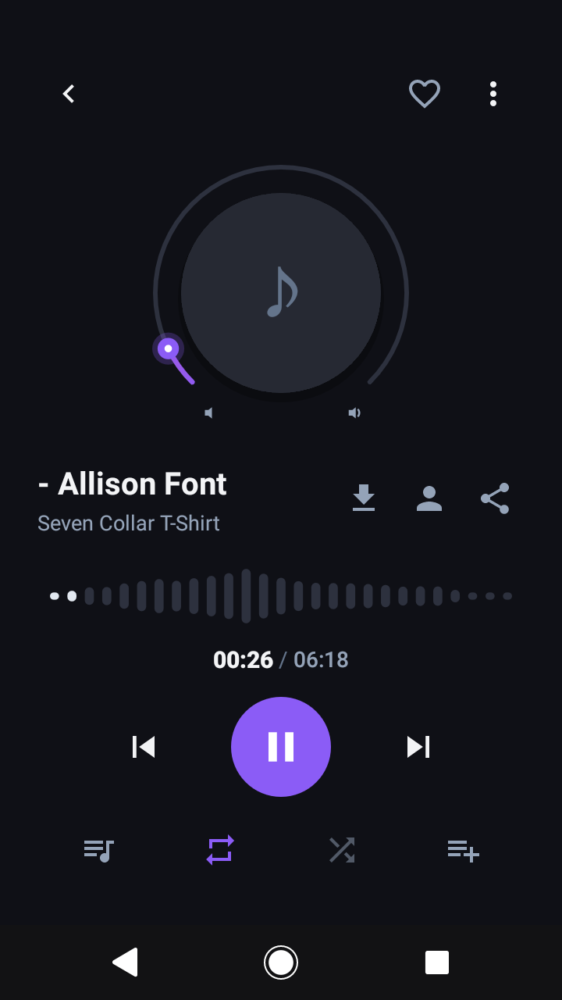
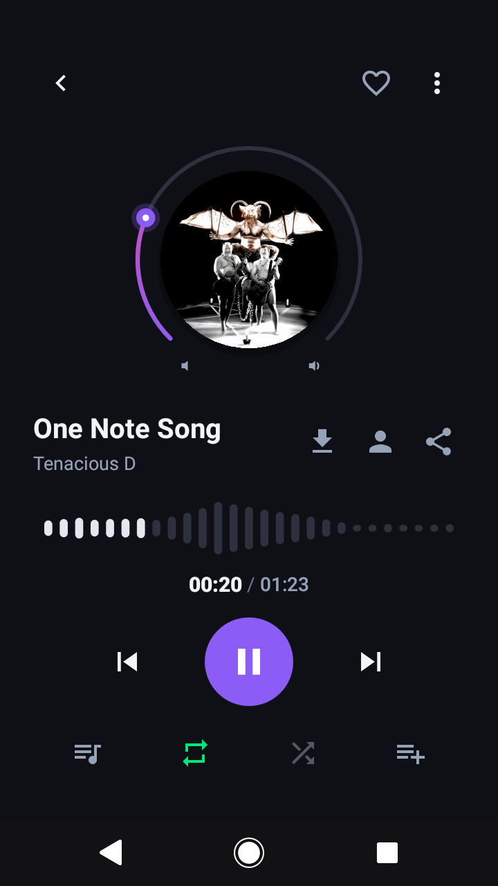
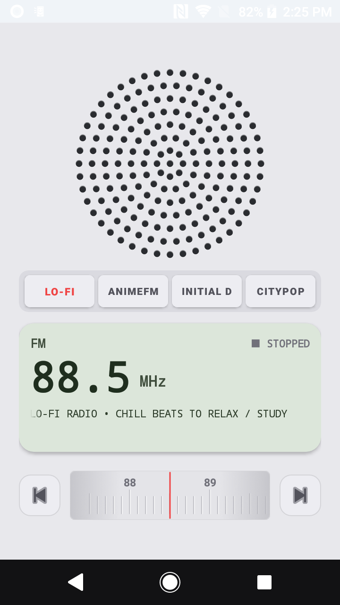

<div align="center">

  

  <br/><br/>

  

  <h1>SPINDLE</h1>
  <p><b>Analog Soul. Hi-Res Heart. Zero Bloat.</b></p>
  <p><i>The ultra-lightweight, hardware-tactile Android Home Launcher specifically crafted to repurpose compact smartphones and low-RAM DAPs into dedicated, physical-feeling audiophile music players.</i></p>

  <p>
    <a href="https://github.com/manaphassan/Spindle/releases"></a>
    
    
    
    
    
    <a href="LICENSE"></a>
  </p>

  <h4>
    <a href="https://manaphassan.github.io/Spindle/">🌐 Live Project Website</a>
    <span> · </span>
    <a href="docs/BRANDING.md">🎨 Branding Guide</a>
    <span> · </span>
    <a href="MASTER_DOCUMENTATION.md">📖 Technical Specs</a>
    <span> · </span>
    <a href="#-quick-start">🚀 Installation</a>
  </h4>

</div>

---

## 💡 The Philosophy: Repurpose, Revive, Rediscover

Modern smartphones are overloaded with algorithmic distractions, background trackers, and bloated operating systems. Meanwhile, millions of compact devices with extraordinary audio hardware—such as the **Sony Xperia X Compact (`SO-02J`)**, **Xperia Z5 Compact**, **LG V20/V30 with Quad-DACs**, and dedicated audio players (**HiBy, FiiO, Shanling, Astell&Kern**)—sit idle in drawers due to low RAM.

**Spindle transforms these devices into dedicated, standalone physical audiophile players:**
- **Zero AI & Zero Cloud Tracking**: No background machine learning models, no intrusive recommendations, no telemetry beacons, no cloud subscriptions. 100% deterministic, local, and private.
- **Pure Physical Feel**: Every dial, switch, knob, and lever is modeled after iconic industrial audio gear, providing rich haptic feedback and mechanical detents.
- **Extreme Low-RAM Architecture**: Runs fluidly at 60 FPS on as little as **1GB RAM** with an idle footprint under **25MB**.
- **Modern Audiophile Catalog & Lyrics**: Elegant single-audio Now Playing screen with circular radial scrub arc, live audio waveform, synced lyrics drawer, and A-Z alphabet index scroller.

---

## 📸 Interface Showcase

<div align="center">
  <table>
    <tr>
      <td width="50%" align="center">
        <b>Flagship Sony Walkman Cassette Deck</b><br/>
        <sub>Centered clear spindle window, column-aligned time, format capsule & kinetic spools</sub><br/><br/>
        
      </td>
      <td width="50%" align="center">
        <b>Dedicated Single Audio Now Playing</b><br/>
        <sub>Minimalist circular cover, radial arc scrubber, dynamic waveform & lyrics drawer</sub><br/><br/>
        
      </td>
    </tr>
    <tr>
      <td width="50%" align="center">
        <b>Audiophile Music Catalog (⏏ EJECT)</b><br/>
        <sub>A-Z alphabet fast scroller, sorting chips, format filters & floating mini-player</sub><br/><br/>
        
      </td>
      <td width="50%" align="center">
        <b>Braun / Dieter Rams Online FM Radio</b><br/>
        <sub>7-ring acoustic grille, 3D cylindrical tuning roller & backlit vintage LCD</sub><br/><br/>
        
      </td>
    </tr>
  </table>
</div>

---

## 🎛️ Key Features

### 1. 📼 Flagship Cassette Deck (Home Launcher)
- **Centered Spindle Deck Window**: Horizontally centered clear acrylic window showcasing mechanical tape spools with true differential kinematics ($v = 4.7625\text{ cm/s}$).
- **Column-Aligned Telemetry Layout**:
  - `WALKMAN` brand header and real-time clock (`TIME`).
  - **Hi-Res Audio Format Capsule Badge**: Positioned directly below the clock displaying bit depth and sample rate (e.g., `FLAC 16-BIT / 44.1 KHZ`, `FLAC 24-BIT / 96.0 KHZ`, `MP3 320 KBPS`).
  - **2-Line Active Track Metadata**:
    - **Line 0**: Bold crisp song title with automatic text wrap.
    - **Line 1**: Artist name and active track duration (`Artist Name • mm:ss / mm:ss`).
- **Auto-Play Progression & State Persistence**: Seamlessly transitions to the next track on playback finish (`REPEAT_MODE_OFF`). Automatically remembers and restores the last-played song and position across launcher reboots.
- **Physical Mechanical Controls**: Authentic `REW`, `FWD`, `PLAY`, and spring-loaded `⏏ EJECT` buttons with haptic clicks.

### 2. 💿 Dedicated Single Audio Now Playing (Catalog Overlay)
- **Minimalist Audiophile Interface**: Pure distraction-free now playing page with deep obsidian backdrop.
- **Circular Album Art & Radial Arc Scrubber**: Custom touch-sensitive radial arc tracking playback progress with smooth rotational touch scrub.
- **Live Dynamic Waveform Visualizer**: Hardware-accelerated 24-band frequency envelope visualizer pulsing in sync with music playback.
- **Hi-Res Format Telemetry Badge**: Real-time pill displaying container, bit depth, sample frequency, and live bitrate (`FLAC 16-bit / 44.1kHz • 846 kbps`).
- **Expandable Synced Lyrics Drawer**: Clean bottom drawer parsing `.lrc` timestamp files with real-time autoscroll, or displaying embedded text lyrics.
- **Technical File Specs Dialog**: Instant inspector revealing codec, format, sample rate, bit depth, channel configuration, exact bitrate, file size, and filesystem path.
- **Audiophile Transport Strip**: Shuffle mode, 3-state Repeat toggle (`Off` ➔ `Repeat All` ➔ `Repeat Single`), track skip (`⏮ / ⏭`), smooth play/pause (`▶ / ❚❚`), and favorite toggle.

### 3. 🗂️ Audiophile Music Catalog (`⏏ EJECT` Overlay)
- **A-Z Fast Alphabet Scroller**: Tactile right-edge vertical alphabet index strip with haptic vibration detents for instant library jumping.
- **Minimalist Sorting & Grouping**: One-tap dialog sorting library by **Title**, **Artist**, **Album**, **Year**, **Duration**, or **Bitrate**.
- **Hi-Res Format Filtering**: Instant filter chips for `All`, `Hi-Res (24-bit+)`, `Lossless (FLAC/WAV)`, and `MP3`.
- **Persistent Floating Mini-Player**: Bottom docked player with track thumbnail, metadata, transport controls, and tap-to-expand into the single audio Now Playing screen.
- **Direct Return to Home**: Tapping back smoothly resumes the physical Sony Walkman cassette home deck.

### 4. 📻 Braun / Dieter Rams Online FM Radio
- **Swipe-to-Tune**: Swiping right from the home deck slides seamlessly into the Dieter Rams-inspired matte ivory radio tuner.
- **Concentric Acoustic Speaker Grille**: Hardware-accelerated custom view rendering concentric perforation rings with realistic acoustic recess shadows.
- **3D Cylindrical Tuning Roller**: Tactile ribbed thumbwheel with moving calibrated frequency scale (`87.5 - 108.0 MHz`), red stationary cursor, and detent vibrations when passing stations.
- **Backlit Vintage LCD Panel**: Mint-green LCD display showing frequency, station RDS marquee, and live stream connection status.
- **Curated Live Streams**: Pre-configured low-latency stations for Lo-Fi, AnimeFM, Initial D World, and CityPop radio.

### 5. 🎚️ Settings, App Drawer & 3 Hardware Themes
- **3 Curated Hardware Themes**:
  - **Audiophile Dark (Obsidian)**: Deep charcoal and OLED black with glowing mint accents.
  - **Monochrome E-Ink**: Ultra-high-contrast pure black and white tailored specifically for e-paper / e-ink DAPs (Onyx Boox, Hisense).
  - **Clean Light (Brushed Aluminum)**: Industrial silver and crisp white minimalist aesthetic.
- **Master Volume Slider Deck**: Tactile hardware slider with Left/Right stereo channel balance visualization.
- **Offline Storage Scanner**: Direct directory selector for microSD card or internal music folders with fast background metadata indexing.
- **Radio Station Manager**: Custom stream URL input and preset bookmark manager.
- **Lightweight App Drawer**: Zero-bloat app launcher (<2MB overhead) for opening companion DAC apps and streaming services.

---

## ⚡ Technical Benchmarks: Extreme Low RAM

| Metric | Standard Android Player | Spindle Launcher | Advantage |
| :--- | :--- | :--- | :--- |
| **Idle Memory** | 120MB – 250MB | **< 25MB** | **85% less RAM** |
| **Active Playback RAM** | 180MB – 350MB | **< 38MB** | **80% less RAM** |
| **APK File Size** | 45MB – 95MB | **< 4.5MB** | **92% smaller** |
| **UI Framework** | Compose / WebView | **Pure Native Canvas** | Zero GC stutters |
| **Bitmap Format** | ARGB_8888 (32-bit) | **RGB_565 (16-bit)** | 50% image cache savings |
| **Background AI / ML** | 150MB+ models | **NONE (0MB)** | Zero battery drain |
| **Min SDK** | Android 10+ | **Android 8.0 (API 26)** | Legacy device revive |

---

## 🛠️ Architecture & Project Structure

```
dap_launcher/
├── app/src/main/
│   ├── java/com/hana/spindle/
│   │   ├── data/                 # Room DB, POSIX Storage Scanner, ImageLoader (RGB_565), TagParser, LyricsParser
│   │   ├── playback/             # ExoPlayer Engine, RadioStreamEngine, AudioMetricsTracker
│   │   ├── launcher/             # Lightweight App Drawer Loader (<2MB overhead)
│   │   ├── theme/                # Cassette Themes & Color Palettes (Dark, E-Ink, Light)
│   │   └── ui/
│   │       ├── cassette/         # Kinetic Reels, VerticalDeckView, CassetteKinematics
│   │       ├── radio/            # Braun Speaker Grille, 3D Ribbed Tuning Dial View, RadioFragment
│   │       ├── catalog/          # CircularCoverArcView, AudioWaveformView, CatalogSortGroup, SortGroupBottomSheet
│   │       ├── AlphabetIndexView # Tactile A-Z alphabet scroller
│   │       ├── LyricsAdapter     # Real-time synced lyrics line adapter
│   │       ├── DialogFileSpecs   # Audiophile technical file specifications inspector
│   │       ├── CatalogFragment   # Music Catalog & Single Audio Now Playing Overlay
│   │       ├── DrawerFragment    # App Drawer, Volume Slider, Themes & Radio Manager
│   │       ├── PlayerFragment    # Center Home Screen Walkman Deck
│   │       └── MainActivity      # 3-Page ViewPager2 Launcher Controller
│   └── res/                      # Hardware vector graphics, layouts, and styles
├── docs/                         # Live GitHub Pages assets and branding guides
│   ├── assets/                   # High-res logos, banners, and verified screenshots
│   ├── BRANDING.md               # Design systems, color specs, and industrial design philosophy
│   └── index.html                # Live interactive showcase page
```

---

## 🚀 Quick Start

### Prerequisites
- Android device or DAP running **Android 8.0 Oreo (API 26)** or newer.
- For USB DAC or 3.5mm Direct ALSA output: Any Qualcomm WCD93xx, Cirrus Logic, ESS Sabre, or AKM equipped device.

### Installation via ADB
```bash
# Clone repository
git clone https://github.com/manaphassan/Spindle.git
cd Spindle

# Build debug APK
./gradlew assembleDebug

# Install directly to connected device
adb install -r app/build/outputs/apk/debug/app-debug.apk

# Launch Spindle
adb shell am start -n com.hana.spindle.debug/com.hana.spindle.ui.MainActivity
```

### Set as Default Home Launcher
1. Navigate to Android **Settings** → **Apps & Notifications** → **Default Apps**.
2. Select **Home app** → Choose **Spindle**.
3. Press hardware Home button anytime to return directly to the Sony Walkman Cassette Player.

---

## 🎨 Design Heritage & Accreditations
- **Sony Walkman WM-2 (1981)**: Industrial design inspiration by Sony Corporation (Norio Ohga & Sony Design Center).
- **Braun T3 / TP1 (1959)**: Acoustic perforation and functional minimalism principles by **Dieter Rams**.
- **Pioneer & Technics Rotary Mixers**: DJ console potentiometer ergonomics and dB ladder ballistics.

---

## 🛡️ License

Spindle is distributed under the **Apache License 2.0**. See the [LICENSE](LICENSE) file for details.

```
Copyright 2026 HaNa Innovation

Licensed under the Apache License, Version 2.0 (the "License");
you may not use this file except in compliance with the License.
You may obtain a copy of the License at

    http://www.apache.org/licenses/LICENSE-2.0
```

<div align="center">
  <sub>Engineered with precision for audiophiles, analog purists, and old hardware preservation.</sub>
</div>
