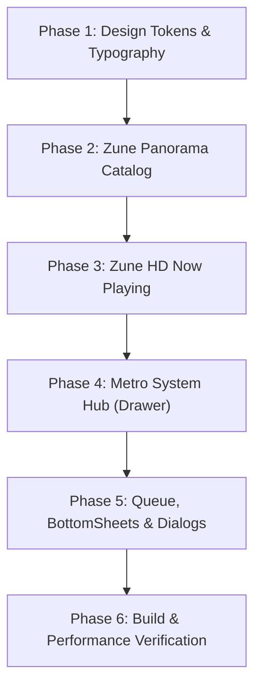

# Spindle Zune Metro UI Revamp Specification & Roadmap

**Branch:** `feature/zune-metro-ui`  
**Base Backup Branch:** `backup/classic-ui-pre-zune`  
**Target Module:** `:app-main`  
**Status:** In Progress (Planning Complete)  
**Date:** October 2026  

---

## 1. Executive Overview & Philosophy

This specification outlines the transformation of Spindle's secondary screens and catalog navigation into the iconic **Microsoft Zune / Windows Phone "Metro" design language**, while **strictly preserving** Spindle's signature analog hardware features:
1. **Cassette Tape Player Deck** (`PlayerFragment.kt` / `VerticalDeckView.kt` / `Metal81ChassisView.kt`)
2. **Bauhaus FM Radio Player** (`RadioFragment.kt` / `RadioTuningDialView.kt`)

All changes adhere to Spindle's core design tenets:
- **Zero Cloud Bloat / 100% Offline**: Deterministic local metadata and tag parsing.
- **Audiophile Performance**: Bit-perfect USB and 3.5mm routing, 32-bit float headroom, gapless playback.
- **Low-RAM Preservation**: `< 25MB - 35MB` heap footprint, pure Android Views (`ViewPager2`, `RecyclerView`, Canvas) with **zero Compose overhead**.
- **Spindle Brand Color Palette**: Dark Indigo (`#2A2E45`), Tangerine Orange (`#F97316`), Peachy Coral (`#FB7185`), Butter Yellow (`#FDE68A`), and Pale Stone (`#FAFAF9`).

---

## 2. Protected Core Features (Untouched)

| Component | File / Path | Reason for Preservation |
| :--- | :--- | :--- |
| **Cassette Player Deck** | `app-main/src/main/java/com/hana/spindle/ui/PlayerFragment.kt` `app-main/src/main/java/com/hana/spindle/ui/cassette/VerticalDeckView.kt` | Spindle's core hardware identity. Rotating differential tape reels, mechanical tape heads, J-Card liner flip, and piano transport keys remain 100% intact. |
| **Bauhaus FM Radio** | `app-main/src/main/java/com/hana/spindle/ui/radio/RadioFragment.kt` `app-main/src/main/java/com/hana/spindle/ui/radio/RadioTuningDialView.kt` | Vintage analog transceiver tuning wheel, red hairline needle, and concentric speaker grille remain 100% intact. |
| **Audiophile Audio Engine** | `:core` module (`AudioEngine.kt`, `AudioFxController.kt`, `AudioBufferManager.kt`) | Core Media3/ExoPlayer pipeline and DSP remain untouched. |
| **Lite Module Isolation** | `:app-lite` | Strictly off-limits. |

---

## 3. Revamped Screens (Zune Metro Specification)

### 3.1 Music Vault / Catalog (`CatalogFragment.kt` & `fragment_catalog.xml`)
- **Header**:
  - Oversized lowercase kinetic typography: `music` (42sp light sans-serif, letter-spacing -0.05em, bleeding off the right edge).
  - Minimalist top bar: `◄ DECK` navigation, real-time scan count badge (`2,242 TRACKS`), and search trigger.
- **Horizontal Panorama / Pivot Navigation**:
  - `quickplay`:
    - **Pins**: High-contrast 2x2 Metro tiles for favorite playlists/mixtapes (e.g. `Synthwave Hi-Res`, `Nightdrive`, `Audiophile 96k`).
    - **History**: Recently played albums/tracks in high-contrast list items.
    - **New Additions**: Square album artwork tiles for newly indexed MicroSD files.
  - `songs`:
    - Clean numbered typographic track rows (`01 Instant Crush • Daft Punk • 5:37 • 24/96k`).
    - Right edge A–Z quick alphabet rail.
  - `artists`:
    - Minimalist artist list with track count chips.
  - `albums`:
    - 2-column or 3-column square artwork grid with bold titles.
  - `playlists`:
    - Smart mixtapes, M3U playlists, and MicroSD auto-sync.
  - `folders`:
    - Directory file-tree navigation for manual file organization.
- **Persistent Bottom Mini-Player**:
  - Flat dark indigo bar with accent Tangerine play/pause button, track title, artist, format badge, and `EXPAND ▲` action.

### 3.2 Expanded Now Playing Screen (`SingleAudioNowPlaying`)
- **Header**:
  - Giant lowercase artist name (e.g. `daft punk` or `astrophysics`) bleeding across the top in light sans-serif.
  - Album name and release year subtext (`Random Access Memories • 2013`).
- **Visual Center**:
  - Full-bleed square album artwork with crisp 1px hairline border (`#353A54`) and subtle ambient background glow.
  - Track title in 20sp bold sans-serif.
  - Format capsule badge: `FLAC 24-BIT / 96.0 KHZ • 1411 KBPS • BIT-PERFECT`.
- **Scrubber & Transport**:
  - Ultra-thin horizontal scrubber with high-contrast Tangerine playhead and monospace timestamps (`02:14 / 05:37`).
  - Minimalist transport keys: Shuffle `🔀`, Prev `⏮`, Hero Play/Pause `[ ⏸ ]`, Next `⏭`, Repeat `🔁`.
  - Slide-up handle for synchronized `.lrc` lyrics drawer.

### 3.3 Left Drawer / System Console (`DrawerFragment.kt` & `fragment_drawer.xml`)
- **Header**:
  - Oversized kinetic `hub` header.
- **Pivot Tabs**:
  - `SOUND / EQ`:
    - Studio 10-Band ISO Hardware Equalizer with flat vertical sliders.
    - Quick DSP presets (`HARMAN`, `FLAT`, `BASS_BOOST`, `VOCAL`, `CLUB`).
  - `TELEMETRY`:
    - Live hardware metrics: DAC interface route, sample rate, bit depth, ReplayGain album gain, buffer latency, RAM usage.
  - `APPS`:
    - Single-column Android app drawer with instant search and Niagara-style alphabet index rail.
  - `SETTINGS`:
    - Streamlined categorized settings: Theme & Display, Audio & Playback, Library & Storage, System & Hardware Key mapping.

### 3.4 Queue & BottomSheets
- `QueueBottomSheet.kt`: Replaced with flat high-contrast Metro list card layout.
- `SortGroupBottomSheet.kt`, `TagInspectorDialog.kt`, `DialogFileSpecs.kt`: Restyled with dark indigo background (`#202334`), crisp typography, and orange accent buttons.

---

## 4. Phase-by-Phase Execution Roadmap

### Phase 1: Typography & Design Tokens
1. Define Metro typography styles in `app-main/src/main/res/values/styles.xml`:
   - `TextAppearance.Spindle.Metro.Hero` (38sp–44sp light sans-serif)
   - `TextAppearance.Spindle.Metro.Pivot` (16sp sans-serif)
   - `TextAppearance.Spindle.Metro.Section` (11sp bold uppercase)
2. Add dimension tokens for Metro tiles and list items in `dimens.xml`.

### Phase 2: Zune Panorama Catalog
1. Update `app-main/src/main/res/layout/fragment_catalog.xml` with the horizontal Panorama and Pivot header.
2. Refactor `CatalogFragment.kt` to bind the Quickplay (Pins, History, New) and list tabs.
3. Update `TrackAdapter.kt` and `AlbumAdapter.kt` for clean Metro row/tile presentation.

### Phase 3: Zune HD Now Playing Overlay
1. Redesign the expanded player overlay in `fragment_catalog.xml`.
2. Connect live scrub, playback state, and lossless format telemetry chips.
3. Style the slide-up lyrics drawer.

### Phase 4: Metro System Hub (Drawer)
1. Redesign `fragment_drawer.xml` to adopt the horizontal `hub` pivot.
2. Rebind `DrawerFragment.kt` to switch between `SOUND / EQ`, `TELEMETRY`, `APPS`, and `SETTINGS`.
3. Preserve all underlying audio DSP, ReplayGain, and app launcher logic.

### Phase 5: Queue, BottomSheets & Dialogs
1. Restyle `bottom_sheet_queue.xml` and `QueueBottomSheet.kt`.
2. Restyle `SortGroupBottomSheet.kt`, `TagInspectorDialog.kt`, and `DialogFileSpecs.kt`.

### Phase 6: Build & Performance Verification
1. Scope build: `./gradlew :app-main:assembleDebug`.
2. Verify package `com.hana.spindle.debug`.
3. Verify memory consumption remains under `< 35MB` heap baseline.
4. Verify Cassette Deck and FM Radio remain 100% operational.
